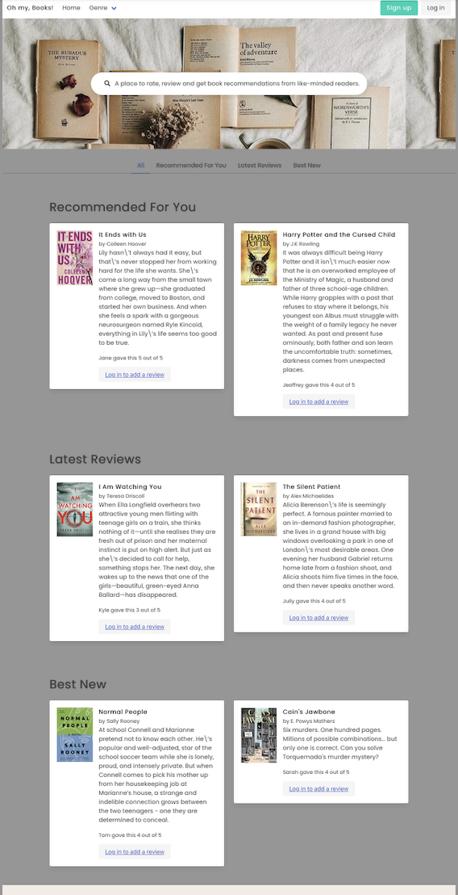
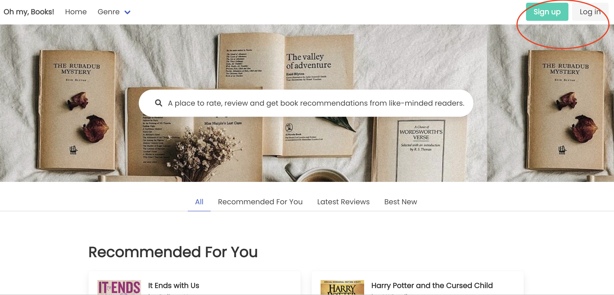
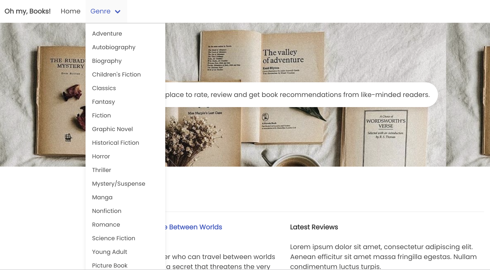

  
  # Project 2: Oh My, Books!

  [A Book Review Application]

  [](https://opensource.org/licenses/MIT)

  ---

## Table of Contents

- [Introduction](#introduction)
- [Oh My Books!](#ohmybooks)
- [User Story](#user_story)
- [Acceptance Criteria](#acceptance_criteria)
- [Description](#description)
- [Installation](#installation)
- [Usage](#usage)
- [Roadmap](#authors)
- [Authors](#authors)
- [Credits](#credits)
- [License](#license)

  ---
## Introduction 

One of the hallmarks of the UCI Bootcamp is the opportunity it gives its students to plan and work on a web application in teams or groups. This highlights the concepts and tools we, as students, have added to our growing arsenal of computer frameworks, languages, and technologies that will make us more employable, as well as showcase our ability to take on real projects, work with other developers, simulate workplace situations and challenges, and even gain the necessary project management skills. 

### Project 2

Since projects play a key role in our journey to becoming a full-stack web developer, Project 2 aims for us, as we enter the last phase of the boot camp and apply for jobs, to show would-be employers our collaborative skills and coding abilities through our portfolio, which will have our deployed Project 2 web application as its focal point.

At the beginning of Project 2, we are assigned to our respective teams, and with our team, we are tasked to conceive and execute a design with the following parameters in mind:

* We will use everything that we have learned over the past six units to create a real-world full-stack application that we will be able to showcase to potential employers.

* In creating our first collaborative full-stack application, we will combine a robust back end--with servers, databases, advanced APIs, and user authentication—-to an intuitive front end. 

* We will continue to build on the agile development methodologies we have used throughout the course, like storing our project code in GitHub, managing our work with a project management tool, and implementing feature and bug fixes using the Git branch workflow and pull requests.

* Instead of using the front end we developed for our first project, we will start from scratch. Doing so will help us reinforce our existing front-end abilities and solidify our understanding of the dynamic between the front end and back end. Also, this will likely improve our skills since that first project, so with a stronger foundation now we can build a better application, using all of the additional practice we have had in the last several weeks.

## Oh My, Books! A Book Review Web Application 

While book reviews are a common feature on bookstore applications or online stores that sell books, the world wide web lacks an application that solely focuses on making users post a review on particular books, the way Yelp does with restaurants and other businesses or Rotten Tomatoes with TV shows and movies. It is with this thought and concept in mind that we have decided to develop this application.

## User Story

```
AS A person who is looking to share his or her experience reading a particular book, or who is looking to find the next book that he or she would like to read,

THE USER WANTS a web application that will allow him or her to rate a book and post a book review about it, or that will allow him or her to read a review by another user,

SO THAT the user can inform other readers of his or her opinion about the book, or that the other user can read a review about the book he or she is interested in reading and make an informed choice whether or not to read the same book and add it to his or her reading queue.

```

## Acceptance Criteria
```
GIVEN the user is looking to post a review on and rate a book the user has recently read, 
WHEN the user opens the book review application, 
THEN the user is presented with the application's landing page, which contains book recoomendations, the latest book reviews, and best new books for the user to consider,
WHEN the user looks at a book featured in the book recommendation, latest reviews, or best new books, 
THEN the user is presented with the following information about the book: title, description, author, International Standard Book Number (ISBN), and genre
WHEN the user wants to review one of the books in the database, 
THEN the user is presented with a link to add a review and is directed to the login page
WHEN the user is not a member of the book review application,
THEN the user is required to create an account by clicking the signup button in order to create and submit a review
WHEN the user clicks the signup button,
THEN the user is presented with the signup page where the user can create an account by entering his or her username, email, and password
WHEN the user has created an account,
THEN the user is presented with the user's profile page which contains the top book pick for the user and a box that will contain all the reviews he will post
WHEN the user has not posted a review yet, 
THEN the user is presented with the message that the user has not reviewed any books yet, and that the user can search and add reviews by using the search bar
WHEN the user has previously signed up or is already a member, 
THEN the user can post a review by clicking the add review link or login button, which will direct the user to the login page
WHEN the user enters his or her credentials, i.e., email and password on the login page,
THEN the user is presented with his or her profile page, which contains the top book picks for the user, the reviews the user have created, and a box where the user can create and submit a book rating and review
WHEN the user adds a review by clicking the Add Review button or entering his or her book review and rating on the given fields and clicking on the Submit button, the book review and rating is saved on the page.
WHEN the user wants to delete a review,
THEN the user can do so by clicking on the Delete button and the review will be deleted from the book page, the user's profile page, and the application's database
WHEN the user wants to search for a book,
THEN the user can search for it using the book's title, author, genre, or ISBN number
WHEN the user clicks on the genre button on the navigation bar, 
THEN the user is presented with different book genres
WHEN the user clicks on one of the genres,
THEN the user is presented with a list of books in the said genre that are available in the database
WHEN the user clicks on Home or Oh My, Books! on the navigation bar, 
THEN the user is directed to the home page which contains the book reviews submitted by the user, as well as the recommended books, latest reviews, and best new books by or for the user.
WHEN the user clicks on the Profile link on the navigation bar, 
THEN the user is directed to the user's profile page
WHEN the user clicks on the Logout button, 
THEN the user logs out of the application.

```

## Description

Oh My Books! is a book review web application that allows users  to rate and post reviews of books that Oh My Books! users have read. The said books can be searched by title, author, or ISBN on the application's database. To start, the application currently features 100 titles with varying authors and genres in its database, with at least five books per genre.

The application has the following interface:

  

The application runs in a browser and is currently deployed at: https://ohmybooks.herokuapp.com/.

The application's code, images, and README files are accessed from this repository: https://github.com/mrjeoffrey/ohmybooks. 

### Features and Functionalities

The application has the following features and functionalities:

1. A landing page that contains book recommendations for any user, the latest book reviews, and the best new books for the user to consider. The books vary for every user who opens the page.

Landing page


2. A signup button that directs the user to the signup page, which allows the users to create an account by posting his or her credentials, i.e., username, email, and password, and post a review.

3. A login button which directs a member to the login page. By entering his or her username and password on the login page, the user is directed to his or her profile page.

Signup and Login buttons


4. A profile page which contains the top book picks for the user, the reviews the user has submitted, a message that prompts the user if he or she has not created any review yet, and the review box which allows the user to enter his or her review and rating on a particular book and submit it. 

Profile Page


Review fields


5. A submit button that allows the user to submit a book review and rating he or she created and saves them on the page.


6. The user can search for a book through its title, author, ISBN, or genre. 

7. Information for every book that appears on the landing or home page, book pages, and profile page, which includes the book's title, author, description, ISBN, and genre.

8. A genre dropdown box which contains all the available book genre in the application's database. Clicking one of the genres will direct the user to the genre's page which contains a list of all the books in the particular genre that are available in the database.



9. A Login to Add a Review and an Add a Review button that directs the user to login to the application or create an account in order to post a review.

10. A Delete button, which allows the user to delete a review from a page.

11. A Logout button which allows the user to log out of the application.

### The Technologies Used
In developing the application, we have used HTML5, CSS3, Bulma, and Vanilla JavaScript.

We have also downloaded and applied the following packages in developing and running our application: 
* bcrypt;
* Connect Session Store Using Sequelize; 
* dotenv;
* express;
* Express Handlebars;
* express-session;
* MySQL2;
* Sequelize;
* ESlint;
* eslint-config-prettier; and
* Prettier.

### Challenges 
The following are the challenges we faced in developing this application:

* We didn't have enough time to polish our work. We feel that we could implement a few things better.
* We were struggling the past week staying up late because we ran into a lot of backend errors and git errors which took a lot of our time to fix.
* We felt if we chose a simpler project idea, we would have finished the project a lot faster.
* The search bar turned out to be a more complicated process that is beyond the skills that we have right now.

### Successes
While we have encountered several challenges in building the application, we have also experiences our own share of successes:
* Getting the backend code that was not initially working to work.
* Getting the Review and Post Review functions to work.
* Creating our own database and API.
* Learning and understanding handlebars better and being able to implement them in our project. 
* Merging to GitHub and committing properly with less conflicts.
* We figured out how to conenct databases with help from Stackoverflow.

### Future Enhancements
The following are features and enhancements we want to implement on this application in the future:
* Increase our database with a larger amount of books so our users will have a larger variety of books to review.
* Implement a personality test feature that determines a user's book preference.
* Create mobile functionality and launch our application on Apple and Android devices.
* Increase our user base through social media.
* Engage with our community and provide community surveys to determine what functions and features they want added.
* Monetize our web application to fund our developers, either through advertisements or creating a subscription-based service with some of the application's features and market them as premium features.


## Installation
To install this web application:

Clone our GitHub repository.
```
https://github.com/mrjeoffrey/ohmybooks
```

The following ```dependencies``` and ```devDependencies``` must be installed and run:

* bycrypt:
```
npm i bycrypt
```

* connect-session-sequelize:
```
npm i connect-session-sequelize
```

* dotenv:
```
npm i dotenv
```

* express:
```
npm i express
```

* express-handlebars:
```
npm i express-handlebars
```

* mysql2:
```
npm i mysql2
```

* sequelize:
```
npm i sequelize
```

* eslint:
```
npm install eslint --save-dev
```

* eslint-config-prettier
```
npm i eslint-config-prettier
```

* prettier
```
npm install --save-dev --save-exact prettier
```


  ---
 ## Usage
Please  refer to the deployed site on Heroku, as well as the content and images in the following sections: Description, User Story, and Acceptance Criteria, and Features and Functionalities.

With users posting their reviews on a particular book, the book review application creates a community of readers with a shared passion for reading books, a particular author, or genre. Through the book review application, they are able to write their opinion on certain books and share their experience reading it. In the process, they inform other readers, encourage (and in some cases, discourage them from) reading a certain book, and build a robust discussion about books online. 

For book authors, publishers, and sellers, the book review application has the capability to inform them how the reading public has received and viewed their books, and which types of stories, authors, or genres there is a current market for. Reviews, whether negative or positive, excite readers and give attention to the book being reviewed, as well as to the products, and in some cases, movies and music, that are relevant to the said book.

  ---
## License
License used for this project - MIT

Copyright 2022. Jeoffrey Batangan, Allyson Vitug, Kyle Kumar, Jully Kim, Jane Tiglao.

Permission is hereby granted, free of charge, to any person obtaining a copy of this software and associated documentation files (the "Software"), to deal in the Software without restriction, including without limitation the rights to use, copy, modify, merge, publish, distribute, sublicense, and/or sell copies of the Software, and to permit persons to whom the Software is furnished to do so, subject to the following conditions:

The above copyright notice and this permission notice shall be included in all copies or substantial portions of the Software.

THE SOFTWARE IS PROVIDED "AS IS", WITHOUT WARRANTY OF ANY KIND, EXPRESS OR IMPLIED, INCLUDING BUT NOT LIMITED TO THE WARRANTIES OF MERCHANTABILITY, FITNESS FOR A PARTICULAR PURPOSE AND NONINFRINGEMENT. IN NO EVENT SHALL THE AUTHORS OR COPYRIGHT HOLDERS BE LIABLE FOR ANY CLAIM, DAMAGES OR OTHER LIABILITY, WHETHER IN AN ACTION OF CONTRACT, TORT OR OTHERWISE, ARISING FROM, OUT OF OR IN CONNECTION WITH THE SOFTWARE OR THE USE OR OTHER DEALINGS IN THE SOFTWARE.

---
## Contributing
  To contribute to this application: 
  Email Jeoffrey Batangan at b.jeoffrey@gmail.com.


  ---
  ## Credits
  The following people/resources were consulted and/or utilized in the development of this application:

  * Gordon Do for the insights, troubleshooting, and coding help.
  * Bulma
  * Stackoverflow
  * Node.js
  * MySql2
  * Express
  * Express Handlebars
  * Sequelize
  * Connect-Session-Equalize
  * dotenv
  * Prettier
  * ESlint
  * Amazon, Google Books, Abe Books for the book information and images

  ---
  ## Authors
  * Joeffrey Batangan (Project Lead, Backend, UI/UX)
  * Allyson Vitug (Backend, Database, UI/UX)
  * Kyle Kumar (UI/UX, Presentation)
  * Jully Kim (Database, Presentation)
  * Jane Tiglao (Database, README)

  ---
  ## Questions
  For questions or issues, please contact: 
  - Jeoffrey Batangan at b.jeoffrey@gmail.com 
  - GitHub: https://github.com/mrjeoffrey


